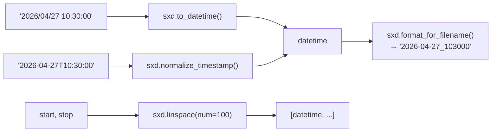

# scitex-datetime

<p align="center">
  <a href="https://scitex.ai">
    
  </a>
</p>

<p align="center"><b>Small datetime helpers — linspace, normalize, parse, format.</b></p>

<p align="center">
  <a href="https://scitex-datetime.readthedocs.io/">Full Documentation</a> · <code>pip install scitex-datetime</code>
</p>

<!-- scitex-badges:start -->
<p align="center">
  <a href="https://pypi.org/project/scitex-datetime/"></a>
  <a href="https://pypi.org/project/scitex-datetime/"></a>
  <a href="https://github.com/ywatanabe1989/scitex-datetime/actions/workflows/test.yml"></a>
  <a href="https://github.com/ywatanabe1989/scitex-datetime/actions/workflows/install-test.yml"></a>
  <a href="https://codecov.io/gh/ywatanabe1989/scitex-datetime"></a>
  <a href="https://scitex-datetime.readthedocs.io/en/latest/"></a>
  <a href="https://www.gnu.org/licenses/agpl-3.0"></a>
</p>
<!-- scitex-badges:end -->

---

## Installation

```bash
pip install scitex-datetime
```

## Architecture

```
scitex_datetime/
├── __init__.py                ← public API (linspace, normalize_timestamp,
│                                 to_datetime, format_for_filename, ...)
├── _linspace.py               ← linearly-spaced datetime arrays
└── _normalize_timestamp.py    ← parse + standardize heterogeneous strings
```

Pure-stdlib datetime helpers; the umbrella `scitex.datetime` import path
is preserved via a `sys.modules`-alias bridge.

## Quick Start

```python
import scitex_datetime as sxd

dt = sxd.to_datetime("2026/04/27 10:30:00")
print(sxd.format_for_filename(dt))   # "2026-04-27_103000"
```

## 1 Interfaces

<details open>
<summary><strong>Python API</strong></summary>

<br>

```python
import scitex_datetime as sxd

# Linearly spaced timestamps
sxd.linspace(start, stop, num=100)

# Parse and standardize timestamps
sxd.normalize_timestamp("2026-04-27T10:30:00")
sxd.to_datetime("2026/04/27 10:30:00")
sxd.validate_timestamp_format("2026-04-27 10:30:00")

# Format
sxd.format_for_display(dt)       # "2026-04-27 10:30:00"
sxd.format_for_filename(dt)      # "2026-04-27_103000"

# Time deltas
sxd.get_time_delta_seconds(dt1, dt2)
```

</details>

## Demo



## Status

Standalone fork of `scitex.datetime`. The umbrella package's `scitex.datetime`
import path is preserved via a `sys.modules`-alias bridge. `STANDARD_FORMAT`
is read from a scitex CONFIG when available, falling back to `"%Y-%m-%d %H:%M:%S"`.

## Part of SciTeX

`scitex-datetime` is part of [**SciTeX**](https://scitex.ai). Install via
the umbrella with `pip install scitex[datetime]` to use as
`scitex.datetime` (Python) or `scitex datetime ...` (CLI).

>Four Freedoms for Research
>
>0. The freedom to **run** your research anywhere — your machine, your terms.
>1. The freedom to **study** how every step works — from raw data to final manuscript.
>2. The freedom to **redistribute** your workflows, not just your papers.
>3. The freedom to **modify** any module and share improvements with the community.
>
>AGPL-3.0 — because we believe research infrastructure deserves the same freedoms as the software it runs on.

## License

AGPL-3.0-only (see [LICENSE](./LICENSE)).

---

<p align="center">
  <a href="https://scitex.ai" target="_blank"></a>
</p>
